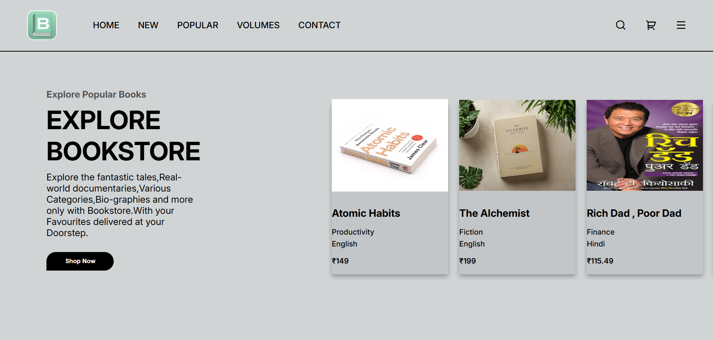

# 📚 The Bookstore Project

A modern, responsive frontend for an online book shop, featuring a dynamic horizontal scrolling product display and a clean UI design.

## 🚀 About The Project
This project is a frontend implementation of an E-commerce platform for books. It focuses on modern UI/UX principles, using a clean layout and interactive elements to improve user experience.

I built this project to master **CSS Layouts (Flexbox)** and **DOM Manipulation** in JavaScript.

### ✨ Key Features
* **Horizontal Product Scroll:** Custom JavaScript implementation to convert vertical mouse wheel scroll into horizontal scroll for the book shelf.
* **Modern UI:** Glassmorphism-inspired product cards and clean typography using Google Fonts (Inter).
* **Interactive Navbar:** Fully styled navigation bar with hover effects and icons.
* **Responsive Design:** Adapts to different screen sizes (Work in Progress).

## 🛠️ Technologies Used
* **HTML5:** Semantic structure.
* **CSS3:** Flexbox for layout, custom scrollbar styling, and responsive design.
* **JavaScript:** Event listeners for custom scrolling behavior.
* **Remix Icon:** For UI icons (Cart, Menu, Search).

## 📂 Project Structure
Bookstore/
├── index.html        # Main HTML file
├── style.css         # Styling rules
└── resources/        # Images folder
    ├── bookstore-logo.png
    ├── atomic-habits.png
    └── ...